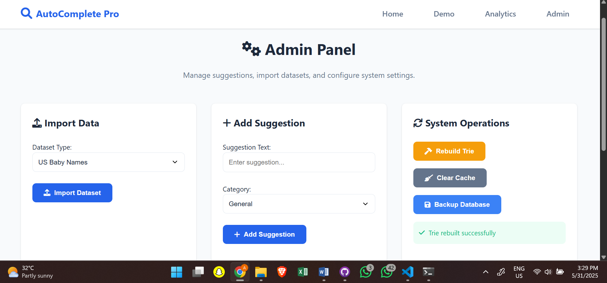

## 📘 AutoFormAI



**AutoFormAI** is an AI-powered, trie-accelerated autocomplete system designed for intelligent form filling and predictive text input. Built with **Flask**, **SQLAlchemy**, and a customized **EnhancedTrie** data structure, it offers blazing-fast text suggestions based on real user data (e.g., U.S. baby names) and synthetic samples (e.g., emails via Faker).

This project blends AI, web development, and scalable backend design, making it ideal for research, education, or production use.

---

## 🚀 Features

* 🔍 **Lightning-Fast Autocomplete**
  Uses an `EnhancedTrie` to deliver suggestions with sub-millisecond response times.

* 🤖 **AI-Augmented Suggestions**
  Learns from user interactions to provide contextually relevant predictions.

* 📊 **Real-Time Analytics Dashboard**
  Interactive visualizations powered by **Chart.js** for usage trends, search counts, and system activity.

* 🛠️ **Admin Panel**
  Upload datasets, rebuild tries, and manage suggestions directly via a secure UI.

* 🌐 **Responsive Interface**
  Fully functional across devices with a modern, mobile-friendly design.

* 🔧 **Scalable Backend**
  Built on Flask-SQLAlchemy with support for SQLite (dev), PostgreSQL (prod), Redis & Celery for asynchronous jobs.

* 📁 **Jupyter-Ready Notebooks**
  Supports EDA, model training, and performance benchmarking with live notebooks.

---

## 🗂️ Project Structure

<details>
<summary>Click to view</summary>

```
AutoFormAI/
├── app/
│   ├── models/              # EnhancedTrie, DB models
│   ├── routes/              # API and web routes
│   ├── static/              # JS, CSS, images
│   ├── templates/           # Jinja2 HTML templates
│   ├── utils/               # Helper functions and validators
│   ├── data/                # App-level data (DB, cache)
├── notebooks/               # Jupyter notebooks for data and model analysis
├── data/                    # Raw and processed datasets
├── tests/                   # Unit tests
├── config/                  # Environment-specific settings
├── docs/                    # API, deployment, and architecture docs
├── requirements/            # Dependency lists
├── Dockerfile               # Docker image config
├── docker-compose.yml       # Multi-container setup
├── init_db.py               # DB initialization script
├── run.py                   # Entry point
├── .env.example             # Example environment config
├── README.md
```

</details>

---

## 🧰 Prerequisites

* Python 3.8+
* Git
* Redis (for background tasks)
* Virtualenv (recommended)
* [US Baby Names Dataset](https://www.kaggle.com/datasets/kaggle/us-baby-names) (`NationalNames.csv`)

---

## ⚙️ Installation

```bash
# 1. Clone the repo
git clone https://github.com/akobabs/AutoFormAI.git
cd AutoFormAI

# 2. Set up virtual environment
python -m venv venv
source venv/bin/activate  # Windows: venv\Scripts\activate

# 3. Install dependencies
pip install -r requirements/development.txt

# 4. Place your dataset
# Download and move 'NationalNames.csv' to:
mkdir -p data/raw/
# Then place the file at: data/raw/NationalNames.csv

# 5. Configure environment
cp .env.example .env
# Edit .env as needed

# 6. Initialize database and build trie
python init_db.py

# 7. Launch the app
python run.py
```

📍 Visit `http://localhost:5000` in your browser.

---

## 🧪 Usage Overview

| Page         | URL Path     | Description                                   |
| ------------ | ------------ | --------------------------------------------- |
| Home         | `/`          | System overview and quick links               |
| Autocomplete | `/form`      | Interactive name/email input with suggestions |
| Analytics    | `/analytics` | Visual dashboard with usage metrics           |
| Admin Panel  | `/admin`     | Import data, manage suggestions, rebuild trie |

---

## 🔌 API Endpoints

| Endpoint              | Method | Description                          |
| --------------------- | ------ | ------------------------------------ |
| `/api/autocomplete`   | POST   | Fetch suggestions for a given prefix |
| `/api/suggestion`     | POST   | Submit a new suggestion              |
| `/api/analytics`      | GET    | Return aggregated usage data         |
| `/api/import-dataset` | POST   | Import new dataset / generate emails |

📄 See [docs/API.md](docs/API.md) for full schema.

---

## 📦 Deployment

### ➤ Local

Follow the setup above.

### ➤ Production

```bash
pip install -r requirements/production.txt
gunicorn -w 4 run:app
```

### ➤ Docker

```bash
docker-compose up --build
```

Access at `http://localhost:8000`.

📄 See [docs/DEPLOYMENT.md](docs/DEPLOYMENT.md) for advanced setups.

---

## 🧪 Testing

Run unit tests:

```bash
pytest
```

---

## 📒 Notebooks

| Notebook                       | Purpose                         |
| ------------------------------ | ------------------------------- |
| `data_analysis.ipynb`          | EDA on names and emails         |
| `model_training.ipynb`         | Training and trie population    |
| `performance_evaluation.ipynb` | Benchmarking speed and accuracy |

To run:

```bash
jupyter notebook notebooks/
```

---

## 🤝 Contributing

We welcome your contributions! 🚀

```bash
# 1. Fork the repo
# 2. Create your branch
git checkout -b feature/awesome-feature

# 3. Commit changes
git commit -m "Add awesome feature"

# 4. Push and open a Pull Request
git push origin feature/awesome-feature
```

✅ Ensure code is clean (`black`, `isort`) and tested.

---

## 📝 License

This project is licensed under the **MIT License**.
See [LICENSE](LICENSE) for details.

---

## 📫 Contact

* **Author**: [@akobabs](https://github.com/akobabs)

---

## ✨ Acknowledgements

* U.S. Baby Names dataset from [Kaggle](https://www.kaggle.com/datasets/kaggle/us-baby-names)
* Flask, SQLAlchemy, Redis, Celery, Faker, and Chart.js

---

> **AutoFormAI** – Powering smarter forms with AI-driven autocomplete.
> *Built for speed. Designed for intelligence.*

---